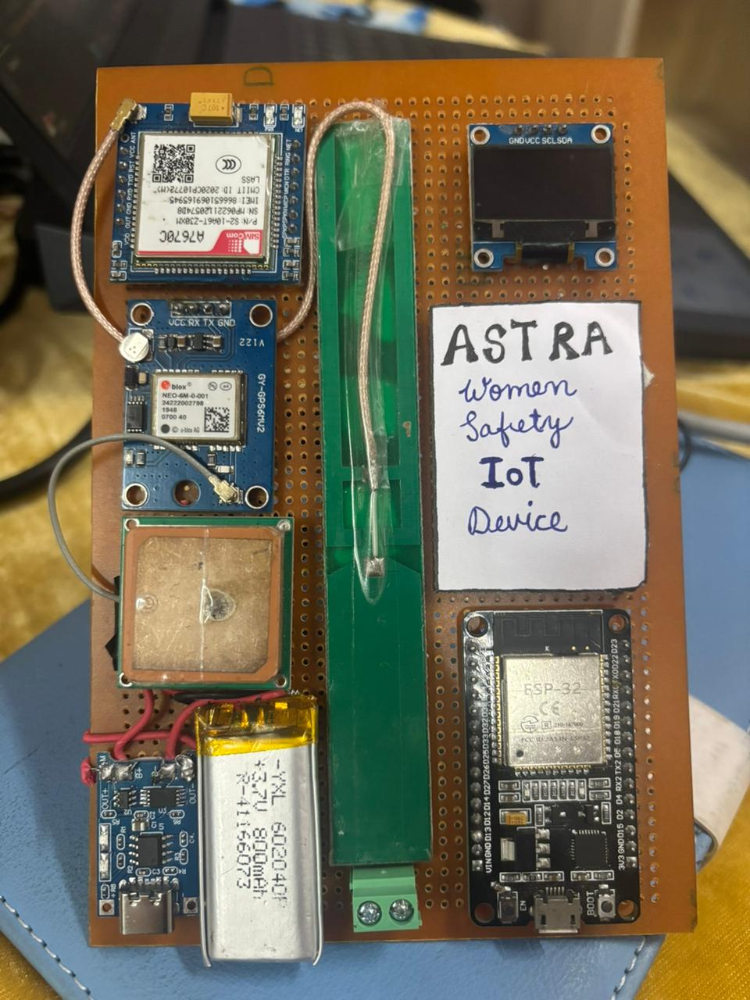

# 🚨 ASTRA – Offline Women Safety IoT System

> ⚡ Built to work when everything else fails — no internet, no delay, no dependency on smartphones.

A real-time, offline-capable emergency safety device designed to ensure **fast, reliable, and instant alerts** using GPS and GSM technology.

---

## 🌍 Why This Matters

In emergency situations, even a few seconds of delay can be critical.

Most existing safety solutions:

* Depend on smartphones and internet
* Require multiple steps to activate
* Fail in low-network or high-stress situations

**ASTRA eliminates these limitations with a dedicated hardware approach.**

---

## 🚨 Problem Statement

Women safety remains a major concern, especially in:

* Rural or low-network areas
* Situations where accessing a phone is difficult
* Emergencies requiring immediate response

Mobile-based solutions often fail when they are needed the most.

---

## 💡 Proposed Solution

**ASTRA** is a dedicated embedded safety device that:

* Works completely offline
* Sends instant SMS alerts with live location
* Activates with a single button press
* Operates reliably even in weak network conditions

---

## ⚙️ System Working

1. User presses SOS button
2. Device activates instantly
3. GPS module acquires location (3–5 seconds)
4. ESP32 processes coordinates
5. GSM module sends SMS with Google Maps link
6. Alert is received by emergency contacts

---

## 🆚 Comparison with Existing Solutions

| Feature             | Mobile Apps | ASTRA     |
| ------------------- | ----------- | --------- |
| Internet Required   | Yes         | ❌ No      |
| Activation Time     | Slow        | ⚡ Instant |
| Reliability         | Medium      | High      |
| Works in Rural Area | ❌ Limited   | ✅ Yes     |

---

## 🧠 Engineering Focus

This system is designed with:

* ⚡ Low latency (5–10 sec alert time)
* 🔋 Power efficiency (deep sleep mode)
* 📡 Offline reliability
* 🔁 Robust GSM communication

---

## 🛡️ Reliability & Fail-Safe Design

* Works without internet dependency
* Minimal user interaction (single button)
* Designed for high-stress emergency scenarios
* Reliable SMS communication under weak signals

---

## 🧰 Hardware Components

* ESP32 Microcontroller
* NEO-6M GPS Module
* GSM Module (A7670 / SIMCOM)
* OLED Display (I2C)
* Li-ion Battery (3.7V)
* TP4056 Charging Module

---

## 🔌 Circuit Connections

| Component  | ESP32 Pins |
| ---------- | ---------- |
| GPS TX     | GPIO16     |
| GPS RX     | GPIO17     |
| GSM TX     | GPIO26     |
| GSM RX     | GPIO27     |
| SOS Button | GPIO4      |

---

## 📊 Performance Results

* ⏱️ Alert Time: 5–10 seconds
* 📍 GPS Accuracy: ±3m (open), ±6m (urban)
* 🔋 Battery Life: Up to 72 hours standby
* ✅ SMS Delivery: 100% success (tested)

---

## 🖼️ Prototype


---

## 🎥 Demo

(Add your demo video link here)

---

## 💻 Firmware

```
firmware/esp32_code/astra.ino
```

---

## 📄 Research Paper

[View Full Paper](docs/research_paper.pdf)

---

## 🧪 Real-World Testing

Tested under:

* Low GSM signal conditions
* Urban and open-sky environments
* Multiple real-time alert scenarios

Consistent and reliable performance observed.

---

## 🚀 Future Enhancements

* AI-based automatic threat detection
* Voice call emergency triggering
* Wearable miniaturized design
* Cloud-based real-time tracking

---

## ⚡ Key Advantages

* Works without internet
* Faster than mobile applications
* Reliable in rural areas
* One-button instant activation

---

## 👨‍💻 Team

This project was collaboratively developed by:

### 🔹 Mayank Saraswati

* Embedded Systems & Hardware Integration
* (Add GitHub / LinkedIn)

### 🔹 Kashish Dhawan

* Research & System Design
* (Add GitHub / LinkedIn)

---

## 📬 Contact

For collaboration or improvements, feel free to connect.
